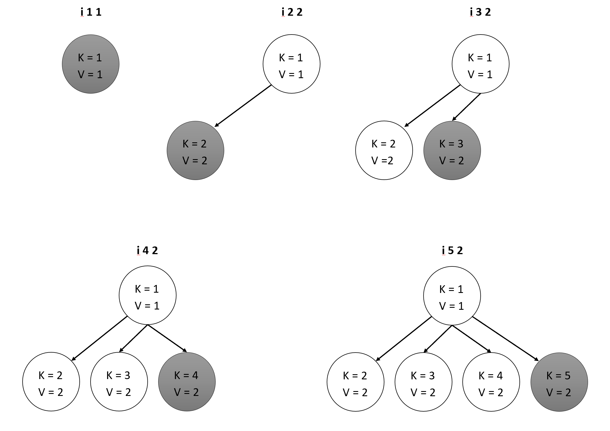
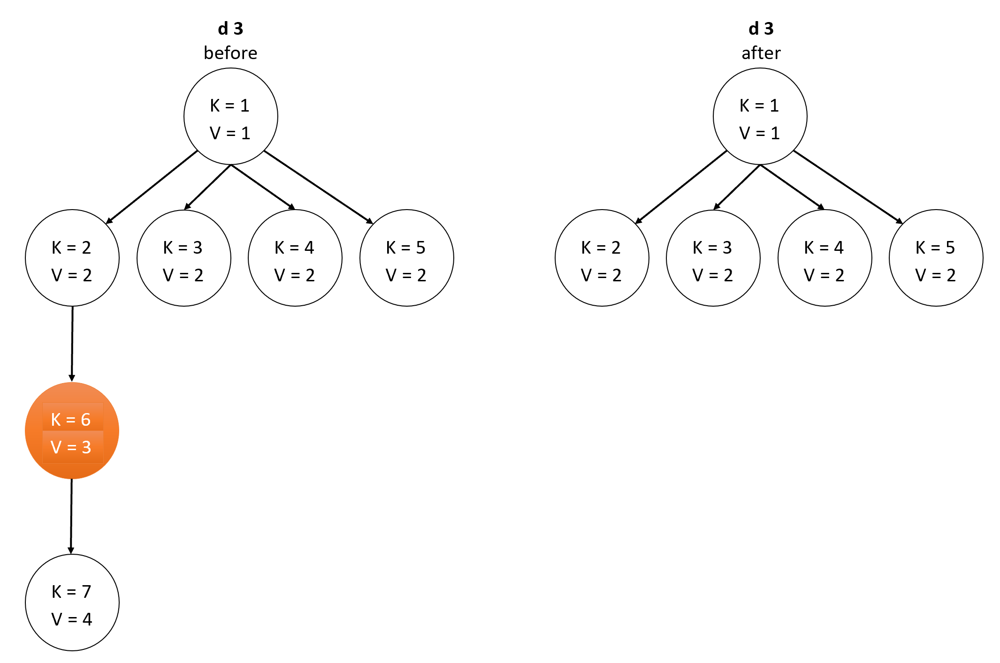
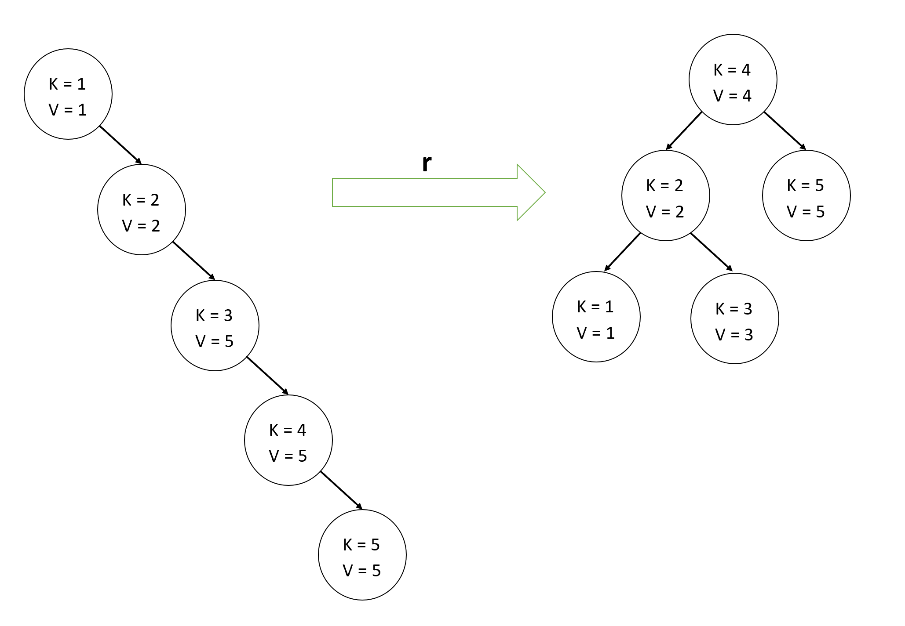
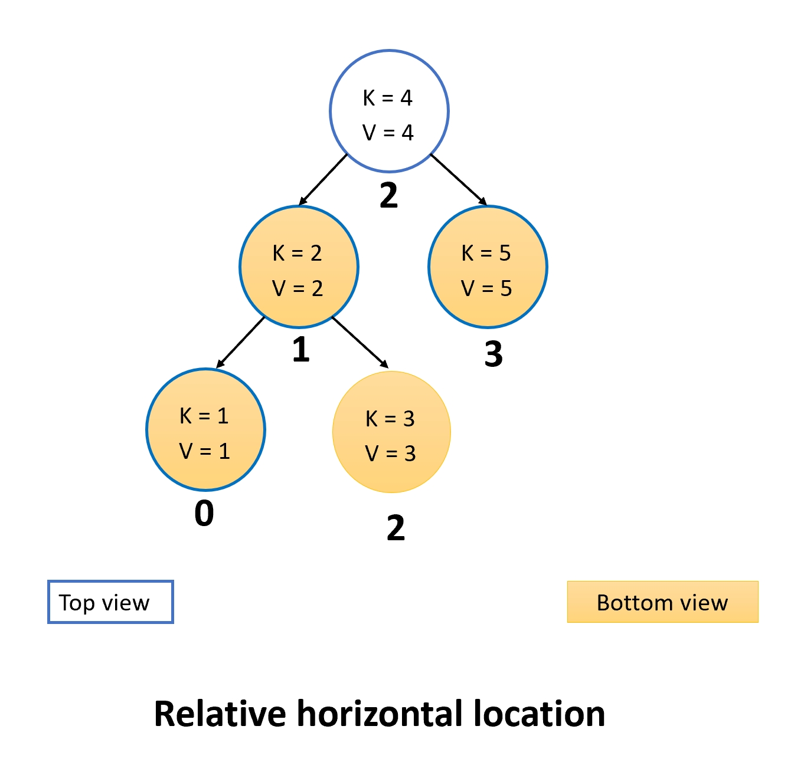

# Homework 3

> Due: 03-12-2021 11:59:59 PM

**Corresponding Topic**:  Trees, Binary Search Tree

## Table of Contents

1. [Homework Content](<#Homework\ Content>)
2. [Homework Submission](<#Homework\ Submission>)
3. [Local Autograder](<#Local\ Autograder>)

**IMPORTANT**: DO NOT CHANGE THE FILE MARKED WITH:

```cpp
/*
 * DO NOT CHANGE THIS FILE!
 *
 */
```

### Homework Content

**You don't have to worry about edge cases other than decribed in each section.**

1. Each Node in TreeNode will have unique trees.  But value can duplicate.

2. An empty tree has height 0.  A tree with only a root node has height 1.

#### Tree

You will find the input file for stack in `[PROJ_ROOT]/input/tree/[num].txt`.

For each line in the input file for binary search tree:

1. `c COMMENTS` All comments will begin with `c`.
2. `t w` Create an empty tree.  Note there will be only one `t` for every file and `t` will always proceed other non-comment commands. ```w``` defines the width of the tree.
3. `i k v` Create a tree node with key = `k` and value = `v` insert the new node into the tree. [See Example Below](#Tree\ Insertion)
4. `l` Print the left view of the tree. [See Example Below](#Tree\ Views)
5. `r` Print the right view of the tree [See Example Below](#Tree\ Views)
6. `d v` Delete the subtree if the subtree root's value is `v` [See Example Below](#Tree\ Deletion)

#### Binary Search Tree (RBT)

**For binary search tree, compare by values instead of keys**
**Always insert the value greater or equal to the root on the right subtree**.

You will find the input file for stack in `[PROJ_ROOT]/input/rbt/[num].txt`.

For each line in the input file for binary search tree:

1. `c COMMENTS` All comments will begin with `c`.
2. `t` Create an empty tree.  Note there will be only one `t` for every file and `t` will always proceed other non-comment commands.
3. `i k v` Create a tree node with key = `k` and value = `v` insert the new node into the tree.
4. `d k` Delete the TreeNode with the key = `k`
5. `t` Print the top view of the tree [See Example Below](#Top\ Bottom\ Views)
6. `b` Print the bottom view of the tree [See Example Below](#Top\ Bottom\ Views)
7. `r` Rebalance the tree using the left leaning red black tree technique. [See Example Below](#BST\ Rebalance)
8. `h` Print the height of the tree

### Examples

#### Tree Insertion



#### Tree Deletion



#### Tree Views


#### BST Rebalance



#### Top Bottom View




### Homework Submission

run

```bash
chmod +x generate_submission

./generate_submission
```

The script `generate_submission` will create a zip file `hw3-submission.zip`.
Please submit `hw3-submission.zip`

This script will ignore all of the files marked with

```cpp
/*
 * DO NOT CHANGE THIS FILE!
 *
 */
```

### Local Autograder

We will be providing the autograder script to help you gauge your results.
run the following in the autograder environment provided by the docker. The released scripts is aimed to be transparent about our grading process. We will not take any regrade request from the local autograder.

```txt
bash-5.0# cd autograder
bash-5.0# chmod +x grade.sh
bash-5.0# ./grade.sh
```

Starting with homework 2, we will run the official autograder twice. Once on Sunday one week after the homework's initial release. And the second time after the homework official deadline.
